# Dust & Glory — Конный клуб

Основная идея проекта - создать сайт конного клуба "Dust & Glory", который предоставляет пользователю полную информацию о клубе.

Сайт позволяет:
- ознакомиться с услугами клуба
- посмотреть актуальные цены
- изучить информацию о лошадях
- просмотреть достижения и блог
- записаться на занятия
---

## Функциональность

- Выделение повторяющихся блоков в partials:
  - head
  - header
  - menu
  - session
  - footer
  - scripts
- Два состояния пользователя:
  - Неавторизован
  - Авторизован

---

## Страницы

- Главная страница `/`
- Услуги `/services`
- Цены `/prices`
- Лошади `/horses`
- Блог `/blog`

---

## Команды

Генерация Prisma Client
```bash
npx prisma generate
```
Создание миграции
```bash
npx prisma migrate dev --name migration_name
```
Заполнение базы тестовыми данными
```bash
npx prisma db seed
```
Запуск Prisma Studio
```bash
npx prisma studio
```
Генерация ER-диаграммы
```bash
npx prisma generate
```
---

## ER-диаграмма



### Таблицы

- **User** - хранит данные пользователей системы  
- **Service** - содержит информацию об услугах конного клуба  
- **Horse** - содержит информацию о лошадях  
- **ScheduleSlot** - хранит временные интервалы расписания занятий  
- **Booking** - таблица бронирований занятий  
- **Review** - таблица отзывов пользователей  

### Связи между таблицами

- `User (1) - (M) Booking`  
  Один пользователь может иметь несколько бронирований.

- `Service (1)- (M) Booking`  
  Одна услуга может быть связана с несколькими бронированиями.

- `Horse (1) - (M) Booking`  
  Одна лошадь может участвовать в нескольких занятиях.

- `ScheduleSlot (1) - (M) Booking`  
  Один слот расписания может быть использован в нескольких бронированиях.

- `User (1) - (M) Review`  
  Пользователь может оставлять несколько отзывов.

### Основная сущность

Центральной таблицей является **Booking**, так как она содержит внешние ключи:

- `userId`
- `serviceId`
- `horseId`
- `slotId`

Таким образом таблица **Booking** связывает пользователя, услугу, лошадь и временной слот расписания.

### Дополнительные элементы

В системе используется перечисление: BookingStatus, которое задаёт возможные состояния бронирования:

- `NEW`
- `CONFIRMED`
- `CANCELED`
- `COMPLETED`